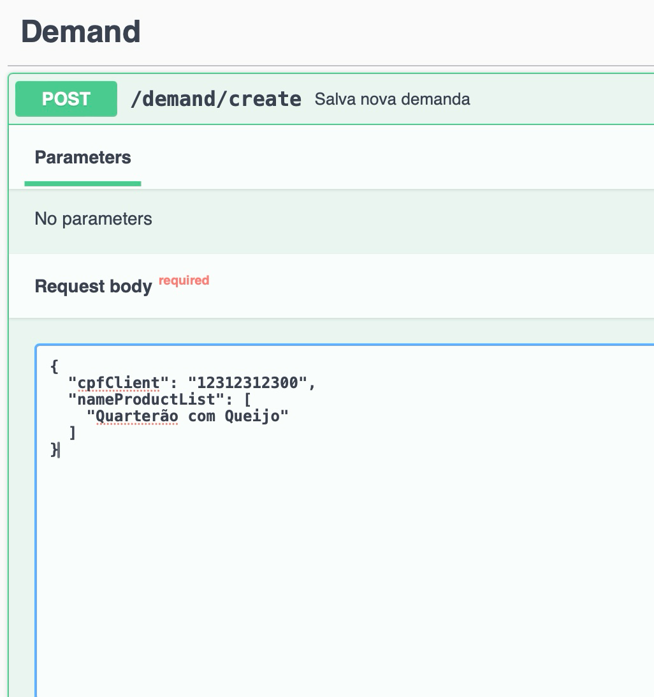

# API FAST-FOOD - MANUAL

### DOCUMENTACAO:
https://miro.com/app/board/uXjVKqr79DQ=/?share_link_id=357707453100

### EXECUTAR APLICACAO EM DOCKER:
> executar comando: docker-compose up -d

### SWAGGER:
- URL: http://localhost:8080/swagger-ui.html
> Documentação do back-end.

### GITHUB
- PARA USAR AS COLLECTIONS CRIADAS E DEMAIS INFORMAÇÕES DO PROJETO ACESSO O GITHUB:
- https://github.com/samueldesouzadev/request-fast-food

### LINK PARA VIDEO DE EXPLICACAO
O VIDEO ESTÁ NO CANAL ABAIXO, É O UNICO VIDEO DISPONÍVEL NO CANAL
- https://www.youtube.com/@SamuelSouza-v1m

A aplicacao quando iniciada, já vem com clientes cadastrados
voce pode utilizalos para fazer teste

> ex: cpf: 12312312300

Tambem temos produtos cadastrados, voce pode utilizados para criar um novo pedido

> ex: nome produto: Quarterão com Queijo

O Status do pedido será atualizado automaticamente de 6 em 6 segundos
até chegar no status de : finalizado